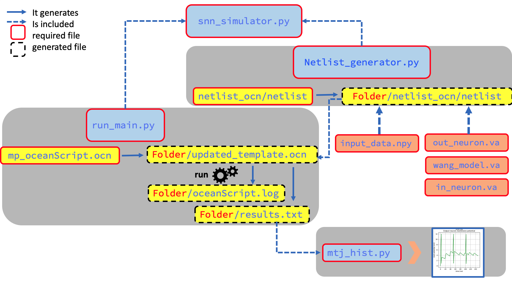

This tool is a complete framework to carry electrical simulations of hardware implemented Spiking Neural Network (SNN) whose synapses are based on Magnetic Tunnel Junctions MTJs. 
The non volatile MTJ memories and their involvment inside the network provides an alternative computing architecture to the Von-Neurman memroy bottelnec. moreover, the operating mechanism of SNN by spikes leads to an energy efficient hardware. 

This framework helps making together all the parts required to run Spice simulations using `Cadence Spectre` simulator. It includes the following device Verilog-A description models: 

1. `MTJ model` : a model that integrates the electrical and magnetic behavior of the MTJ and simulate its use as a two state memory device. Credits to Fert Beijing Institut, China.
2. `input neuron model` : a spiking neuron model developed in-house to stand as an input neuron that incodes the input images and feed thme to the network.
3. `output neuron model` : a leak integrate and fire neuron model that is used as an output neuron. it is developed in-house.

Along with these necessary device descriptions, a netlist that describes the full network is required. The framework allows an automatic generation of a netlist that describes the full SNN network of any size. The operator only needs to input some basic information like the number of input and output neurons, the number of MTJs/synapse, a time window during whitch an input image is presented to the network, so that the framework can generate the corresponding netlist. 

Once the netlist has been generated, the simulation is lanched automatically in `Spectre`. It inputs the image pixels to the netowrk, the input neurons spike according to a given coding and signal is fed forward in form of current that allwos the network to learn the paterns using the Spike Timing Dependent Plasticity STDP rule which is specific to SNNs. The framework tracks the history of each synapse and neuron in the network. It finally allows diffrent ploting and visualisation fonctionalities. 

The following diagram summurises every file involved in the simulaiton of SNN online training and it output visualisation, and how they interact in an automatic way. 

