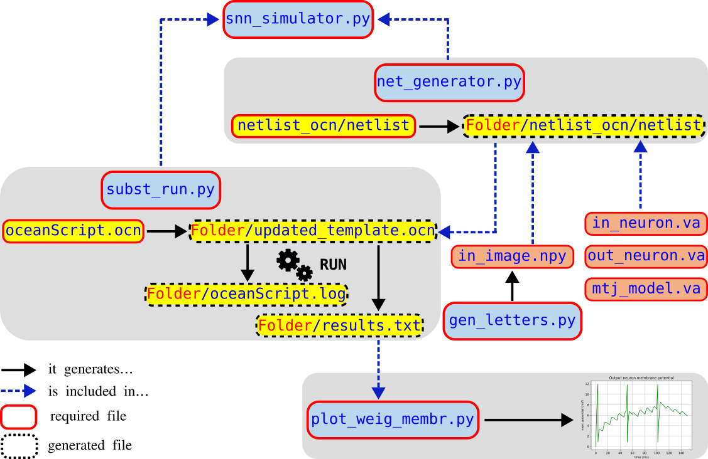

The framework's architecture which is summarized in [Figure 1](#framework) is modular. Each module is geared towards simplifying and automating the complex processes involved in SNN design, training, and analysis. The scripts of the framework work together to perform simulations and analysis of the SNN, with the main Python script (`snn_simulator.py`) coordinating the flow between the following components:

1. First, the `gen_letters.py` script generates images of various letters for training. Using a specific script to generate personalized images allow us to control the complexity and size of training dataset, each image is saved as `.npy` file in the `letter_imgs` directory. Additionally, it saves a dictionary of all images in a pickle file for later use. There is also a possibility to train the network with images from MNIST. for that, a small set of MNIST images should first be extracted using `extract_mnist.py` and optionally visualize it using `see_image.py`. Thes scripts and the generated images are organized in `input_images` directory from which the simulator loads the inputs.

2. Next, the main script (`snn_simulator.py`) orchestrates the entire simulation process. It sets up simulation parameters, prepares combinations for multiprocessing, and runs the simulations in parallel using the `run_simulation` function. This function loads the generated `.npy` image files and flattens them to create input data for the SNN simulation. These images represent the spiking neurons' intensity, which is used to configure the neuron inputs. The user is requested to input design and simulation options in this main script. Subsequently, design choices such as the number of input and output neurons and the synapse composition are handed to `net_generator.py` to generate the netlist. Similarly, simulation options such as step, duration and file paths are handed to `subst_run.py` to prepare the ocean script that should be executed. It might be worth highlighting the parallel processing capability of the framework, this means that we can train many SNNs with different sizes and design parameters at the same time, with a complete separation between the input and output files of each SNN, and with no intervention from the user.

3. The `net_generator.py` script is responsible for generating the netlist file required for the simulation. It uses various classes to define components of the SNN, such as synapses, input neurons, and output neurons. These components are assembled into a complete netlist file, which includes references to the Verilog-A models. If different SNN sizes are requested to run in parallel, the main script tells the netlist generator to output each `netlist` in a different simulation directory.

4. The `subst_run.py` script contains utility functions for substituting values into templates and executing shell commands. The main script uses `subst_run.substitute_templ` to replace placeholders in the `oceanScript.ocn` template with actual values from the simulation parameters. It then uses `subst_run.exec_cmd` to run the simulation commands using the substituted script (final Ocean script) and the generated netlist. In short, the script `subst_run.py` has two functions: first, it prepares the final ocean script by substituting the user-defined parameters in a generic template (`oceanScript.ocn`). Second, it executes shell commands to run the simulation.

5. The `oceanScript.ocn` file is an OCEAN script used by the Cadence Spectre simulator to set up and run a transient analysis for the SNN simulation. It specifies the design file, analysis parameters, environment options, and variables, and it controls the simulation flow and data saving. This script is crucial for defining how the simulation should be run and what data should be saved.

6. The Verilog-A models (`in_neuron.va`, `out_neuron.va`, and `mtj_model.va`) define the behavior of the different components in the SNN. The `in_neuron.va` file models the input neurons that generate spikes, the `out_neuron.va` file models the output neurons with leaky integrate-and-fire behavior, and the `mtj_model.va` file models the PMA MTJ based on the STT mechanism. These models are included in the netlist and are used by the simulator to simulate the electrical behavior of the SNN.

7. After the simulations are run, the `plot_weig_membr.py` script reads the output data (`results.txt`) produced by the simulations. It uses `matplotlib` to plot the weights history and membrane potentials of the neurons during training, providing a visual representation of the simulation results. These visualizations are saved as PDF files for further analysis. If the simulations consists of variability study od the SNN, `plot_eucl_dist.py` allows to evaluate the resiliance of the netwok against the variability. In fact, it calculates the euclidian destance between the weights of a dependable SNN and the weights of an ideal one, it then plots the euclidian distnaces with respect to the dependability magnitude (standard deviation of the variability distribution, injected defects values, ...) 

In summary, the process starts with generating input images using `gen_letters.py`, which are then used by `snn_simulator.py` to set up and run simulations. The `net_generator.py` script creates the necessary netlist files, while `subst_run.py` substitutes parameters in the `oceanScript.ocn` template and executes the simulation commands. The Verilog-A models define the behavior of the SNN components, and the `plot_weig_membr.py` script visualizes the simulation results. This integrated workflow allows for efficient simulation and analysis of SNNs.

The following diagram summurises every file involved in the simulaiton of SNN online training and it output visualisation, and how they interact in an automatic way. 

{#framework}

<b>Figure 1:</b> Overview of the SNN Training Framework detailing module interactions and data flow.

